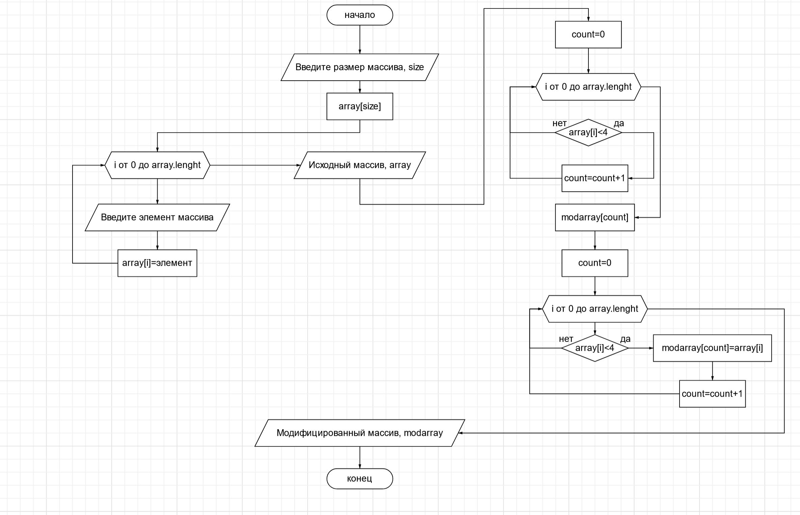

#  Итоговая проверочная работа 
## 1. Задача
Написать программу, которая из имеющегося массива строк формирует массив из строк, длина которых меньше либо равна 3 символа.
## 2. Описание алгоритма
1. Вввод размера массива
2. Создание пустого массива
3. Вызов метода наполнения массива (ввод элементов с клавиатуры)
4. Вывод начального массива в консоль
5. Вызов метода создания модифицированного массива
- перебор в цикле элементов начального массива
- счетчик количества элементов меньше или равно 3
- создание модифицированного массива с количеством элементов из счетчика
- перебор в цикле элементов начального массива
- заполнеение модифицированного массива элементами меньше или равно 3
6. Вывод модифицированного массива в консоль

## 3. Блок-схема
